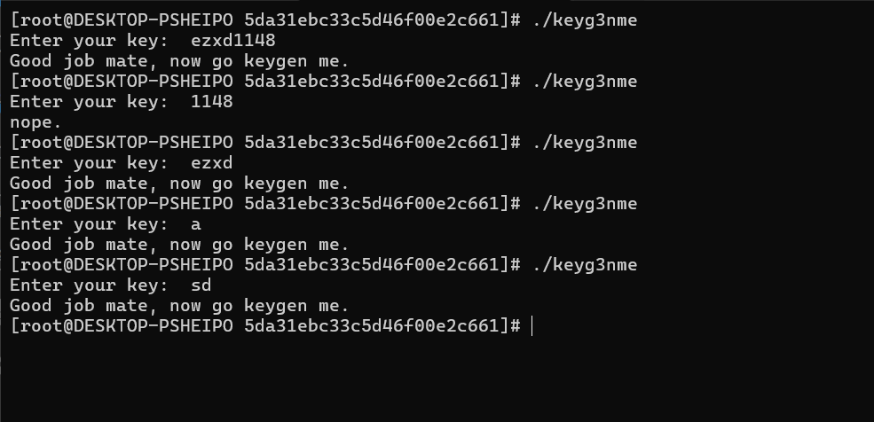
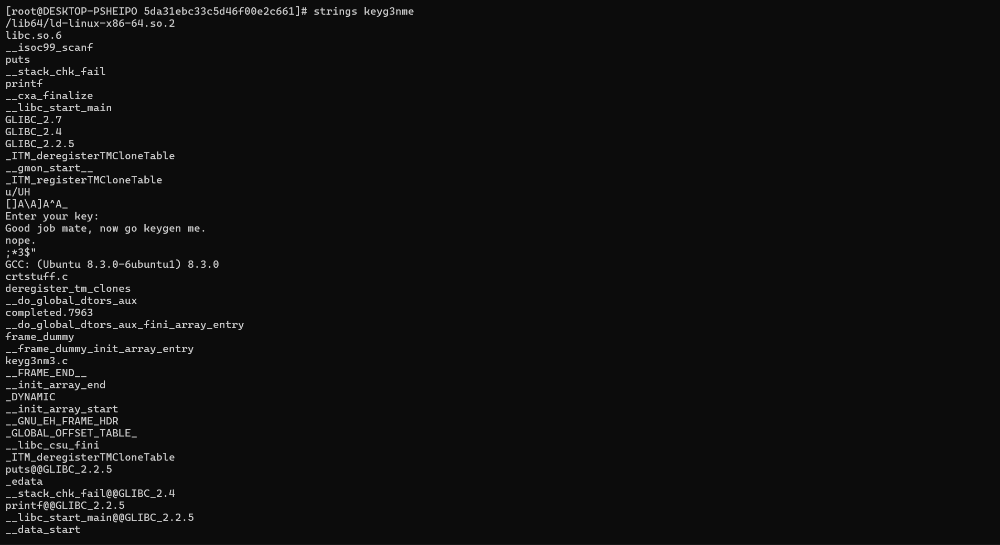
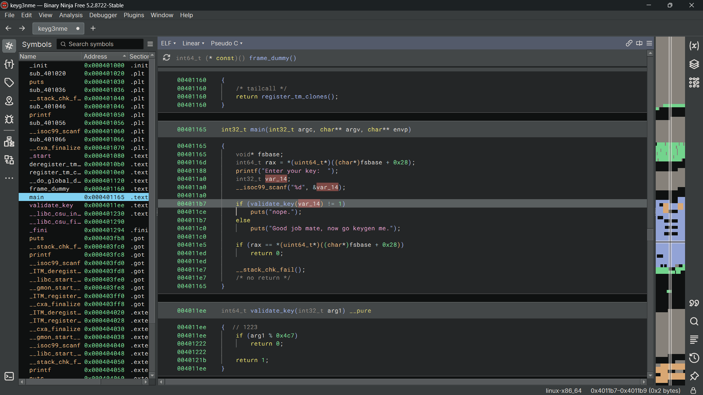

# keyg3nme

## Steps

This challenge is pretty straightforward and easy

Tools used:
- Binary Ninja

After running keyg3nme on my archlinux wsl. It asks for an input. I've tried several things like my username and some numbers

Surprisingly we got 2 output here. "nope" and "Good job mate, now go keygen me."

if we run strings command to keyg3nme to potentially see readable output we get this

As we can see here, only 3 is really human readable text. That is how we can confirm "nope" is a failed input and the other is successful input. We want to crack what makes it "successful"

Here, I ran Binary Ninja on keyg3nme and find the main function

here we can see the if else returning nope and the other text. But I noticed the 32-bits integer "var_14" a.k.a user input is inputted through validate_key. If we look at validate key function just below the main function. It is very straightforward. It takes user input and take the remainder of user input and 0x4c7 or 1223 in base 10. Then it returns 0 if true(Output 0). 

But the thing is why did my name (ezxd1148) work? It is because int32 only accepts integer but we inputted strings. It is actually an error but it got "else:" there, so it printed ("Good job mate, now go keygen me.")